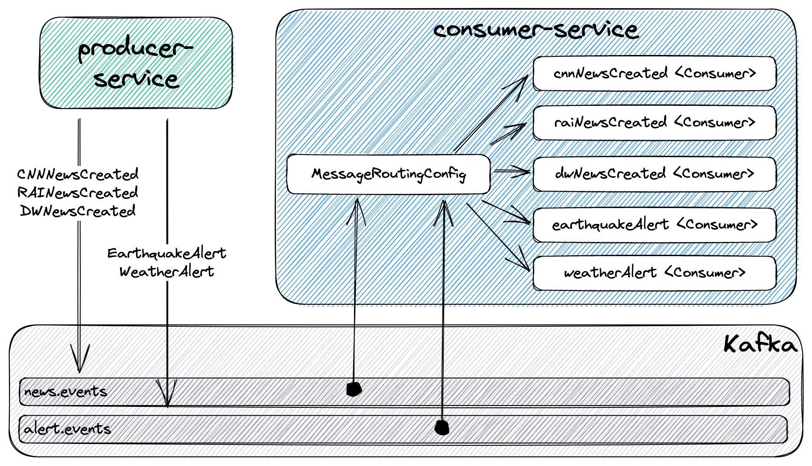

# spring-cloud-stream-event-routing-cloudevents

The goal of this project is to play with [`Spring Cloud Stream Event Routing`](https://docs.spring.io/spring-cloud-stream/docs/current/reference/html/spring-cloud-stream.html#_event_routing) and [`CloudEvents`](https://cloudevents.io/). For it, we will implement a producer and consumer of `news` & `alert` events.

## Project Diagram



## Applications

- ### producer-service

  [`Spring Boot`](https://docs.spring.io/spring-boot/docs/current/reference/htmlsingle/) application that exposes a REST API to submit `news` & `alert` events.

  Endpoints
  ```
  POST /api/news/cnn {"title":"..."}
  POST /api/news/dw {"titel":"..."}
  POST /api/news/rai {"titolo":"..."}
  POST /api/alerts/earthquake {"richterScale":"...", "epicenterLat":"...", "epicenterLon":"..."}
  POST /api/alerts/weather {"message":"..."}
  ```

- ### consumer-service

  `Spring Boot` application that consumes the `news` & `alert` events published by `producer-service`.

## Prerequisites

- [`Java 17+`](https://www.oracle.com/java/technologies/downloads/#java17)
- [`Docker`](https://www.docker.com/)
- [`Docker-Compose`](https://docs.docker.com/compose/install/)

## Start Environment

- Open a terminal and inside `spring-cloud-stream-event-routing-cloudevents` root folder run
  ```
  docker-compose up -d
  ```

- Wait for Docker containers to be up and running. To check it, run
  ```
  docker-compose ps
  ```

## Running Applications with Maven

- **producer-service**

  - In a terminal, make sure you are in `spring-cloud-stream-event-routing-cloudevents` root folder
  - Run the command below to start the application
    ```
    ./mvnw clean spring-boot:run --projects producer-service
    ```

- **consumer-service**

  - Open a new terminal and navigate to `spring-cloud-stream-event-routing-cloudevents` root folder
  - Run the command below to start the application
    ```
    ./mvnw clean spring-boot:run --projects consumer-service
    ```

## Running Applications as Docker containers

- ### Build Docker Images

  - In a terminal, make sure you are inside `spring-cloud-stream-event-routing-cloudevents` root folder
  - Run the following script to build the Docker images
    - JVM
      ```
      ./docker-build.sh
      ```
    - Native
      ```
      ./docker-build.sh native
      ```

- ### Environment Variables

  - **producer-service**

    | Environment Variable | Description                                                             |
    |----------------------|-------------------------------------------------------------------------|
    | `KAFKA_HOST`         | Specify host of the `Kafka` message broker to use (default `localhost`) |
    | `KAFKA_PORT`         | Specify port of the `Kafka` message broker to use (default `29092`)     |

  - **consumer-service**

    | Environment Variable | Description                                                             |
    |----------------------|-------------------------------------------------------------------------|
    | `KAFKA_HOST`         | Specify host of the `Kafka` message broker to use (default `localhost`) |
    | `KAFKA_PORT`         | Specify port of the `Kafka` message broker to use (default `29092`)     |

- ### Run Docker Containers

  - **producer-service**
    
    Run the following command in a terminal
    ```
    docker run --rm --name producer-service -p 9080:9080 \
      -e KAFKA_HOST=kafka -e KAFKA_PORT=9092 \
      --network=spring-cloud-stream-event-routing-cloudevents_default \
      ivanfranchin/producer-service:1.0.0
    ```

  - **consumer-service**
    
    Open a new terminal and run the following command
    ```
    docker run --rm --name consumer-service -p 9081:9081 \
      -e KAFKA_HOST=kafka -e KAFKA_PORT=9092 \
      --network=spring-cloud-stream-event-routing-cloudevents_default \
      ivanfranchin/consumer-service:1.0.0
    ```

## Playing around

In a terminal, submit the following POST requests to `producer-service` and check its logs and `consumer-service` logs

> **Note**: [HTTPie](https://httpie.org/) is being used in the calls bellow

- **news**
  ```
  http :9080/api/news/cnn title="NYC subway strike"
  http :9080/api/news/dw titel="Berliner Untergrundstreik"
  http :9080/api/news/rai titolo="Sciopero della metropolitana di Roma"
  ```

- **alerts**
  ```
  http :9080/api/alerts/earthquake richterScale=5.5 epicenterLat=37.7840781 epicenterLon=-25.7977037
  http :9080/api/alerts/weather message="Thunderstorm in Berlin"
  ```

## Useful links

- **Kafdrop**

  `Kafdrop` can be accessed at http://localhost:9000

## Shutdown

- To stop applications, go to the terminals where they are running and press `Ctrl+C`
- To stop and remove docker-compose containers, network and volumes, go to a terminal and, inside `spring-cloud-stream-event-routing-cloudevents` root folder, run the following command
  ```
  docker-compose down -v
  ```

## Running Test Cases

In a terminal, make sure you are inside `spring-cloud-stream-event-routing-cloudevents` root folder

- **producer-service**
  ```
  ./mvnw clean test --projects producer-service
  ```

- **consumer-service**
  ```
  ./mvnw clean test --projects consumer-service
  ```

## Cleanup

To remove the Docker images created by this project, go to a terminal and inside `spring-cloud-stream-event-routing-cloudevents` root folder, run the following script
```
./remove-docker-images.sh
```

## References

- https://docs.spring.io/spring-cloud-stream/docs/current/reference/html/spring-cloud-stream.html
- https://stackoverflow.com/questions/61135632/spring-cloud-function-separate-routing-expression-for-different-consumer

## Issues

When running the native image of `producer-service` and `consumer-service`, the containers don't connect to Kafka. The `KAFKA_HOST` environment variable informed (that is `kafka`) is not replaced correctly as the application is trying to connect to `localhost/127.0.0.1:9092`.
```
INFO 1 --- [| adminclient-1] org.apache.kafka.clients.NetworkClient   : [AdminClient clientId=adminclient-1] Node -1 disconnected.
WARN 1 --- [| adminclient-1] org.apache.kafka.clients.NetworkClient   : [AdminClient clientId=adminclient-1] Connection to node -1 (localhost/127.0.0.1:9092) could not be established. Broker may not be available.
```