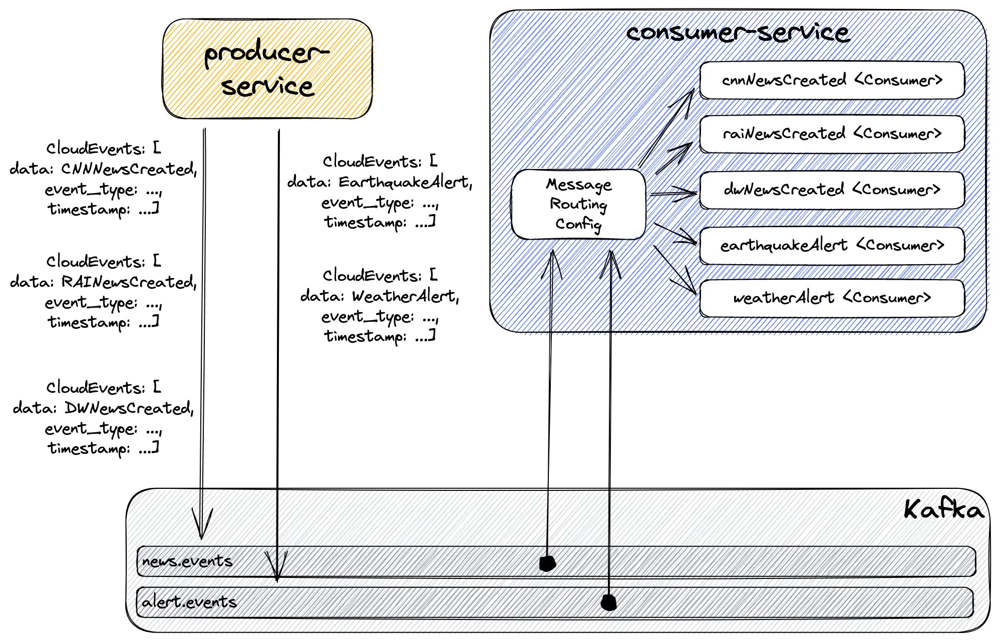

# spring-cloud-stream-event-routing-cloudevents

The goal of this project is to play with [`Spring Cloud Stream Event Routing`](https://docs.spring.io/spring-cloud-stream/docs/current/reference/html/spring-cloud-stream.html#_event_routing) and [`CloudEvents`](https://cloudevents.io/). For it, we will implement a producer and consumer of `news` & `alert` events.

## Proof-of-Concepts & Articles

On [ivangfr.github.io](https://ivangfr.github.io), I have compiled my Proof-of-Concepts (PoCs) and articles. You can easily search for the technology you are interested in by using the filter. Who knows, perhaps I have already implemented a PoC or written an article about what you are looking for.

## Additional Readings

- \[**Medium**\] [**How to Route CloudEvents messages with Spring Cloud Stream**](https://medium.com/@ivangfr/how-to-route-cloudevents-messages-with-spring-cloud-stream-3cf7a5ab4e17)
- \[**Medium**\] [**Implementing a Kafka Producer and Consumer using Spring Cloud Stream**](https://medium.com/@ivangfr/implementing-a-kafka-producer-and-consumer-using-spring-cloud-stream-d4b9a6a9eab1)
- \[**Medium**\] [**Implementing Unit Tests for a Kafka Producer and Consumer that uses Spring Cloud Stream**](https://medium.com/@ivangfr/implementing-unit-tests-for-a-kafka-producer-and-consumer-that-uses-spring-cloud-stream-f7a98a89fcf2)
- \[**Medium**\] [**Implementing End-to-End testing for a Kafka Producer and Consumer that uses Spring Cloud Stream**](https://medium.com/@ivangfr/implementing-end-to-end-testing-for-a-kafka-producer-and-consumer-that-uses-spring-cloud-stream-fbf5e666899e)
- \[**Medium**\] [**Configuring Distributed Tracing with Zipkin in a Kafka Producer and Consumer that uses Spring Cloud Stream**](https://medium.com/@ivangfr/configuring-distributed-tracing-with-zipkin-in-a-kafka-producer-and-consumer-that-uses-spring-cloud-9f1e55468b9e)
- \[**Medium**\] [**Using Cloudevents in a Kafka Producer and Consumer that uses Spring Cloud Stream**](https://medium.com/@ivangfr/using-cloudevents-in-a-kafka-producer-and-consumer-that-uses-spring-cloud-stream-9c51670b5566)

## Project Diagram



## Applications

- ### producer-service

  [`Spring Boot`](https://docs.spring.io/spring-boot/index.html) application that exposes a REST API to submit `news` & `alert` events.

  Endpoints
  ```text
  POST /api/news/cnn {"title":"..."}
  POST /api/news/dw {"titel":"..."}
  POST /api/news/rai {"titolo":"..."}
  POST /api/alerts/earthquake {"richterScale":"...", "epicenterLat":"...", "epicenterLon":"..."}
  POST /api/alerts/weather {"message":"..."}
  ```

- ### consumer-service

  `Spring Boot` application that consumes the `news` & `alert` events published by `producer-service`.

## Prerequisites

- [`Java 25`](https://www.oracle.com/java/technologies/downloads/#java25) or higher.
- A containerization tool (e.g., [`Docker`](https://www.docker.com), [`Podman`](https://podman.io), etc.)

## Start Environment

- Open a terminal and inside the `spring-cloud-stream-event-routing-cloudevents` root folder run:
  ```bash
  docker compose up -d
  ```

- Wait for Docker containers to be up and running. To check it, run:
  ```bash
  docker ps -a
  ```

## Running Applications with Maven

- **producer-service**

  - In a terminal, make sure you are in the `spring-cloud-stream-event-routing-cloudevents` root folder;
  - Run the command below to start the application:
    ```bash
    ./mvnw clean spring-boot:run --projects producer-service
    ```

- **consumer-service**

  - Open a new terminal and navigate to the `spring-cloud-stream-event-routing-cloudevents` root folder
  - Run the following command to start the application:
    ```bash
    ./mvnw clean spring-boot:run --projects consumer-service
    ```

## Running Applications as Docker containers

- ### Build Docker Images

  - In a terminal, make sure you are inside the `spring-cloud-stream-event-routing-cloudevents` root folder;
  - Run the following script to build the Docker images:
    - JVM
      ```bash
      ./build-docker-images.sh
      ```
    - Native
      ```bash
      ./build-docker-images.sh native
      ```

- ### Environment Variables

  - **producer-service**

    | Environment Variable | Description                                                             |
    |----------------------|-------------------------------------------------------------------------|
    | `KAFKA_HOST`         | Specify host of the `Kafka` message broker to use (default `localhost`) |
    | `KAFKA_PORT`         | Specify port of the `Kafka` message broker to use (default `29092`)     |

  - **consumer-service**

    | Environment Variable | Description                                                             |
    |----------------------|-------------------------------------------------------------------------|
    | `KAFKA_HOST`         | Specify host of the `Kafka` message broker to use (default `localhost`) |
    | `KAFKA_PORT`         | Specify port of the `Kafka` message broker to use (default `29092`)     |

- ### Run Docker Containers

  - **producer-service**
    
    Run the following command in a terminal:
    ```bash
    docker run --rm --name producer-service -p 9080:9080 \
      -e KAFKA_HOST=kafka -e KAFKA_PORT=9092 \
      --network=spring-cloud-stream-event-routing-cloudevents_default \
      ivanfranchin/producer-service:1.0.0
    ```

  - **consumer-service**
    
    Open a new terminal and run the following command:
    ```bash
    docker run --rm --name consumer-service -p 9081:9081 \
      -e KAFKA_HOST=kafka -e KAFKA_PORT=9092 \
      --network=spring-cloud-stream-event-routing-cloudevents_default \
      ivanfranchin/consumer-service:1.0.0
    ```

## Playing around

In a terminal, submit the following POST requests to `producer-service` and check its logs and the `consumer-service` logs

> **Note**: [HTTPie](https://httpie.org/) is being used in the calls below.

- **news**
  ```bash
  http :9080/api/news/cnn title="NYC subway strike"
  http :9080/api/news/dw titel="Berliner Untergrundstreik"
  http :9080/api/news/rai titolo="Sciopero della metropolitana di Roma"
  ```

- **alerts**
  ```bash
  http :9080/api/alerts/earthquake richterScale=5.5 epicenterLat=37.7840781 epicenterLon=-25.7977037
  http :9080/api/alerts/weather message="Thunderstorm in Berlin"
  ```

## Useful links

- **Kafdrop**

  `Kafdrop` can be accessed at http://localhost:9000

## Shutdown

- To stop applications, go to the terminals where they are running and press `Ctrl+C`
- To stop and remove docker compose containers, network and volumes, go to a terminal and, inside the `spring-cloud-stream-event-routing-cloudevents` root folder, run the following command:
  ```bash
  docker compose down -v
  ```

## Running Test Cases

In a terminal, make sure you are inside the `spring-cloud-stream-event-routing-cloudevents` root folder:

- **producer-service**
  ```bash
  ./mvnw clean test --projects producer-service
  ```

- **consumer-service**
  ```bash
  ./mvnw clean test --projects consumer-service
  ```

## Cleanup

To remove the Docker images created by this project, go to a terminal and inside the `spring-cloud-stream-event-routing-cloudevents` root folder, run the following script:
```bash
./remove-docker-images.sh
```
